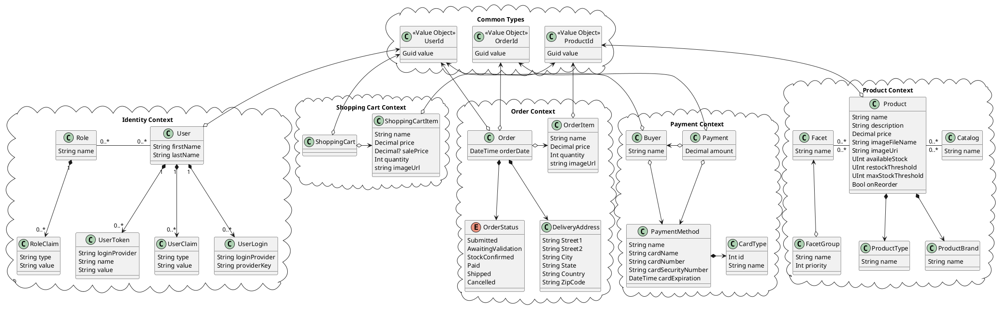

```plantuml
@startuml
    top to bottom direction

    cloud "Identity Context" {
        class User {
            String firstName
            String lastName
        }

        class UserClaim {
            String type
            String value
        }

        class UserLogin {
            String loginProvider
            String providerKey
        }

        class UserToken {
            String loginProvider
            String name
            String value
        }

        class Role {
            String name
        }

        class RoleClaim {
            String type
            String value
        }
    }

    User "1" *-d-> "0..*" UserClaim
    User "1" *-d-> "0..*" UserLogin
    User "1" *-d-> "0..*" UserToken
    User "0..*" -l- "0..*" Role
    Role "1" *-d-> "0..*" RoleClaim

    cloud "Product Context" {
        class Product {
            String name
            String description
            Decimal price
            String imageFileName
            String imageUri
            UInt availableStock
            UInt restockThreshold
            UInt maxStockThreshold
            Bool onReorder
        }

        class ProductType {
            String name
        }

        class ProductBrand {
            String name
        }

        class Catalog {
            String name
        }

        class FacetGroup {
            String name
            Int priority
        }

        class Facet {
            String name
        }
    }
    
    Product *-d-> ProductType
    Product *-d-> ProductBrand
    Product "0..*" -r- "0..*" Catalog
    Product "0..*" -l- "0..*" Facet
    FacetGroup o-u-> Facet

    cloud "Shopping Cart Context" {
        class ShoppingCart {
        }

        class ShoppingCartItem {
            String name
            Decimal price
            Decimal? salePrice
            Int quantity
            string imageUrl
        }
    }

    ShoppingCart o-r-> ShoppingCartItem

    cloud "Order Context" {
        class Order {
            DateTime orderDate
        }

        class OrderItem {
            String name
            Decimal price
            Int quantity
            string imageUrl
        }

        enum OrderStatus {
            Submitted
            AwaitingValidation
            StockConfirmed
            Paid
            Shipped
            Cancelled
        }

        class DeliveryAddress {
            String Street1
            String Street2
            String City
            String State
            String Country
            String ZipCode
        }
    }

    Order o-r-> OrderItem
    Order *--> DeliveryAddress
    Order *--> OrderStatus

    cloud "Payment Context" {
        class Buyer {
            String name
        }

        class Payment {
            Decimal amount
        }

        class PaymentMethod {
            String name
            String cardName
            String cardNumber
            String cardSecurityNumber
            DateTime cardExpiration
        }

        class CardType {
            Int id
            String name
        }
    }

    Buyer o-d-> PaymentMethod
    Payment o-l-> Buyer
    Payment o--> PaymentMethod
    PaymentMethod *-r-> CardType

    cloud "Common Types" {
        class "<<Value Object>>\nUserId" as UserId {
            Guid value
        }

        class "<<Value Object>>\nProductId" as ProductId {
            Guid value
        }
        
        class "<<Value Object>>\nOrderId" as OrderId {
            Guid value
        }
    }

    UserId <-d-o User
    UserId <-d-o ShoppingCart
    UserId <-d-o Buyer
    UserId <-d-o Order
    ProductId <-d-o Product
    ProductId <-d-o OrderItem
    ProductId <-d-o ShoppingCartItem
    OrderId <-d-o Order
    OrderId <-d-o Payment
@enduml
```