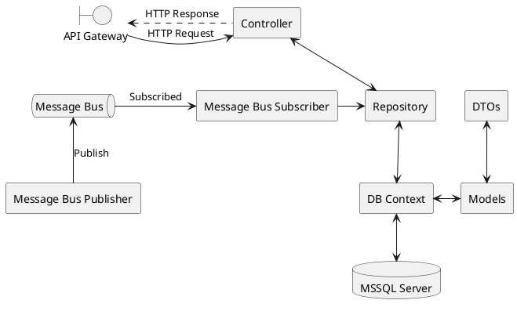

# Product Service Architecture

```plantuml
@startuml
    queue "Message Bus"as messageBus
    rectangle "Message Bus Subscriber" as messageBusSubscriber
    rectangle "Message Bus Publisher" as messageBusPublisher
    
    boundary "API Gateway"as apiGateway
    rectangle "Controller" as controller

    rectangle "Repository" as repo
    rectangle "DTOs" as dtos
    rectangle "Models" as models
    rectangle "DB Context" as dbContext
    database "MSSQL Server" as db

    apiGateway <-[hidden]-> messageBus
    apiGateway -right-> controller : "HTTP Request"
    apiGateway <.right. controller : " HTTP Response"
    controller <-[hidden]down-> messageBusSubscriber
    controller <-right-> repo

    messageBus -right-> messageBusSubscriber : "Subscribed"
    messageBus <-down- messageBusPublisher : "Publish"
    messageBusSubscriber -right-> repo

    repo <-[hidden]right-> dtos
    repo <-down-> dbContext
    dtos <-down-> models
    models <-left-> dbContext
    dbContext <-down-> db
@enduml
```