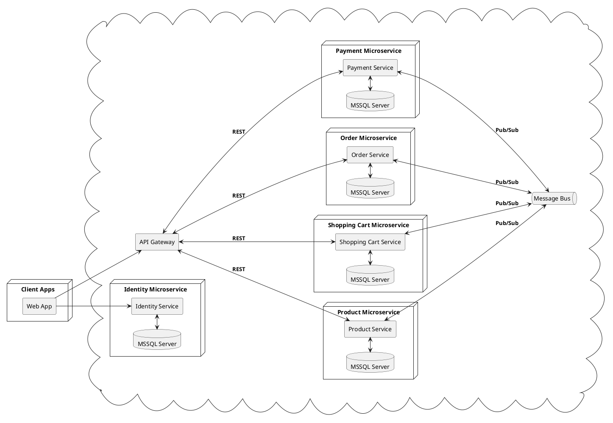

# Solution Architecture

```plantuml
@startuml
    left to right direction

    together {
        node "Client Apps" as clientApps {
            rectangle "Web App" as webApp
        }

        cloud " " as microServices {
            rectangle "API Gateway" as apiGateway
            queue "Message Bus" as messageBus

            node "Identity Microservice" as identityMicroservice {
                rectangle "Identity Service" as identityService
                database "MSSQL Server" as identityDatabase
            }

            node "Product Microservice" as productMicroservice {
                rectangle "Product Service" as productService
                database "MSSQL Server" as productDatabase
            }

            node "Shopping Cart Microservice" as shoppingCartMicroservice {
                rectangle "Shopping Cart Service" as shoppingCartService
                database "MSSQL Server" as shoppingCartDatabase
            }

            node "Order Microservice" as orderMicroservice {
                rectangle "Order Service" as orderService
                database "MSSQL Server" as orderDatabase
            }

            node "Payment Microservice" as paymentMicroservice {
                rectangle "Payment Service" as paymentService
                database "MSSQL Server" as paymentDatabase
            }
        }

        webApp -[hidden]r- microServices
        webApp -d-> apiGateway
        webApp -d-> identityService

        apiGateway <-d-> productService :  "<b>REST</b>"
        apiGateway <-d-> shoppingCartService :  "<b>REST</b>"
        apiGateway <-d-> orderService :  "<b>REST</b>"
        apiGateway <-d-> paymentService :  "<b>REST</b>"

        messageBus <-u-> productService : "<b>Pub/Sub</b>"
        messageBus <-u-> shoppingCartService : "<b>Pub/Sub</b>"
        messageBus <-u-> orderService : "<b>Pub/Sub</b>"
        messageBus <-u-> paymentService : "<b>Pub/Sub</b>"

        identityService <-l-> identityDatabase
        productService <-l-> productDatabase
        shoppingCartService <-l-> shoppingCartDatabase
        orderService <-l-> orderDatabase
        paymentService <-l-> paymentDatabase
    }
@enduml
```